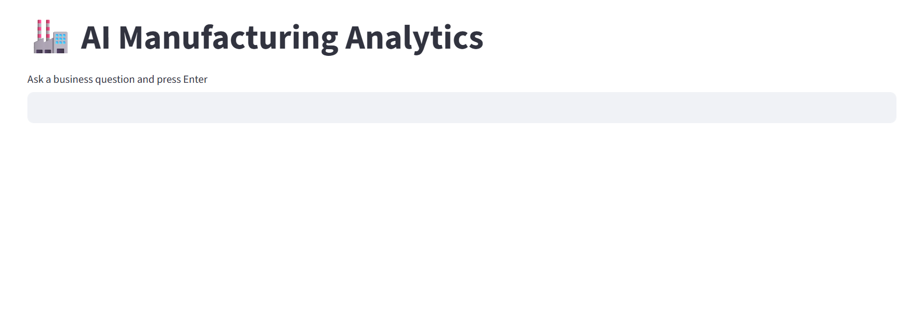
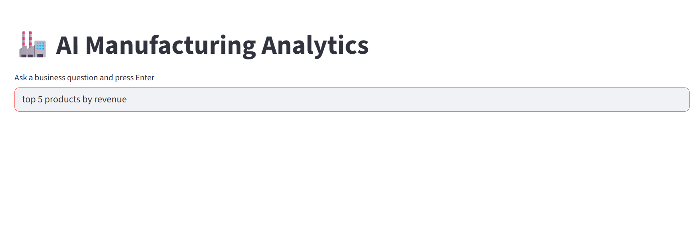
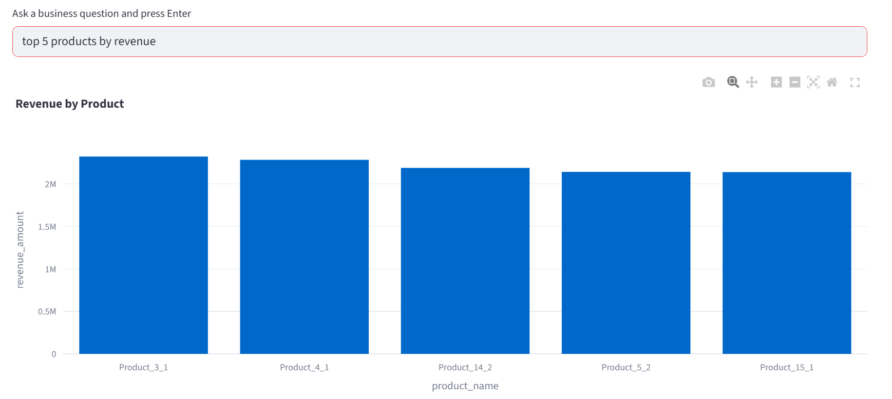
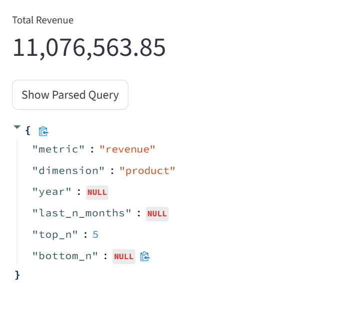

# 🚀 AI Manufacturing Analytics Dashboard


An **AI-powered analytics dashboard** that allows users to query manufacturing or business data using **natural language**.

The system uses a **Large Language Model (LLM)** to interpret business questions and convert them into structured analytics queries. The results are processed using **Pandas** and visualized using **Plotly** inside a **Streamlit dashboard**.

This project demonstrates how **LLM + Data Analytics** can simplify business intelligence workflows.

---

# 🌐 Live Demo

Run locally:

```bash
streamlit run app.py
```

Or view the deployed application:

```
https://your-streamlit-app-link.streamlit.app
```

---

# 📸 Application Screenshots

## Dashboard



---

## Query Input

Example query:

```
top 5 products by revenue
```



---

## Visualization Output

Top 5 products by revenue visualization.



---

## Parsed Query (LLM Output)

The system converts natural language queries into structured parameters.



---

# ✨ Key Features

• Natural language analytics queries
• LLM-powered query understanding
• Automatic metric detection
• Data aggregation using Pandas
• Interactive visualizations using Plotly
• Streamlit dashboard interface
• SQLite database integration
• Parsed query JSON display

---

# 🧠 Example Query Pipeline

```
User Question
   ↓
LLM Query Parsing
   ↓
Structured Query
   ↓
Pandas Data Processing
   ↓
Plotly Visualization
   ↓
Dashboard Output
```

---

# 🏗 System Architecture

```
           USER QUESTION
                 │
                 ▼
        Streamlit Dashboard UI
                 │
                 ▼
        Query Understanding Engine
        (LLM + Rule-Based Parsing)
                 │
                 ▼
            Data Processing
              (Pandas)
                 │
                 ▼
        Aggregation & Metrics
                 │
                 ▼
         Visualization Engine
            (Plotly)
                 │
                 ▼
            Dashboard Output
```

---

# 🛠 Technology Stack

| Technology        | Purpose                              |
| ----------------- | ------------------------------------ |
| Python            | Core programming language            |
| Streamlit         | Interactive dashboard UI             |
| Pandas            | Data manipulation                    |
| Plotly            | Interactive visualization            |
| Google Gemini API | Natural language query understanding |
| SQLite            | Data storage                         |

---

# 📁 Project Structure

```
llm-analytics-dashboard
│
├── app.py
├── manufacturing.db
├── requirements.txt
├── README.md
│
└── assets
    ├── dashboard.png
    ├── query.png
    ├── chart.png
    └── parsed_query.png
```

---

# ⚙ Installation

### 1️⃣ Clone the repository

```bash
git clone https://github.com/your-username/llm-analytics-dashboard.git
```

### 2️⃣ Navigate to the project folder

```bash
cd llm-analytics-dashboard
```

### 3️⃣ Install dependencies

```bash
pip install -r requirements.txt
```

### 4️⃣ Run the application

```bash
streamlit run app.py
```

---

# 🔐 API Key Setup

This project uses **Google Gemini API**.

Add your API key using **Streamlit Secrets**.

Example:

```
GEMINI_API_KEY="your_api_key_here"
```

In `app.py`:

```python
import streamlit as st
import google.generativeai as genai

genai.configure(api_key=st.secrets["GEMINI_API_KEY"])
```

---

# 💡 Example Queries

Users can ask questions like:

• top 5 products by revenue
• bottom 3 customers by sales
• revenue by region
• monthly sales trend
• total revenue for last 3 months

The system automatically **interprets the query and generates analytics insights**.

---

# 🚀 Roadmap

Future improvements planned:

• SAP HANA integration
• Azure cloud deployment
• Real-time analytics pipeline
• Multi-database support
• Advanced LLM reasoning
• User authentication and roles

---

# 🤝 Contributing

Contributions are welcome.

1. Fork the repository
2. Create a new branch
3. Commit your changes
4. Submit a pull request

---

# 👩‍💻 Author

**Pathuri Bhuvaneswari**

B.Tech Student | AI & Data Science Enthusiast

Interested in building **AI-powered analytics systems and intelligent data applications**.

---

# ⭐ Support

If you found this project useful, please consider giving it a **star ⭐ on GitHub**.
